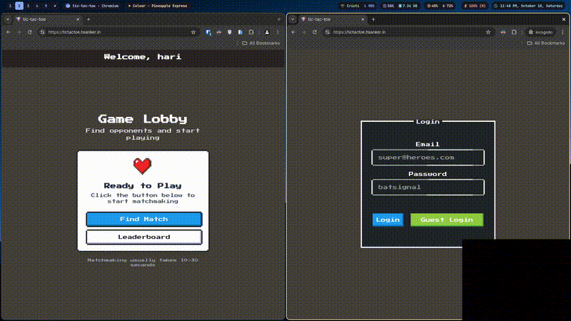

# Tic Tac Toe

A Server authoritative real-time multiplayer Tic Tac Toe game built with [nakama](https://heroiclabs.com/nakama/) and react.

[Live Demo](https://tictactoe.hsanker.in)



## Features

- **Real-time Multiplayer**
- **Leaderboard**
- **Matchmaking**

## Technology Choices

### Nakama Server

- [Nakama](https://heroiclabs.com/nakama/) was a true [nakama](https://cotoacademy.com/meaning-nakama-used-japanese-expressions/#:~:text=%2Dpronounced%20%E2%80%9CNakama%E2%80%9D%20is%20a%20word%20that%20translates%20to%20your%20friend%2C%20teammate%2C%20or%20comrade.) while building this, doing all the heavylifting. Nakama handles Auth, Matchmaking, Leaderboard.
- For a simple project like this, implementing a separate backend would have been redundant. All game logic is implemented within Nakama's MatchHandler lifecycle methods and an rpc for client to fetch matches.
- The server follows Nakama's documentation patterns and best practices.
- The server is built using a Dockerfile that bundles all match handlers and RPC functions into a custom Nakama image. This is the recommended way in the docs.
- TypeScript was chosen for server-side development due to familiarity and Nakama's JavaScript runtime support.

### React Client

- React was selected for the frontend due to extensive familiarity and simply because it is the fastest way I know, to build UI.
- Nakama has SDK for js, which also led to this decision.
- **Security Note**: The server key is exposed in client-side code, which is a security consideration. In traditional web development, CORS would typically enable servers to filter invalid clients. However, since Nakama uses the server key for client identification and this is a personal project, this trade-off was deemed acceptable for development purposes. Maybe, a filter could've been added to the loadbalancer/router in the server.

### Deployment

- The docker compose file at root bundles both server and client services along with postgres(for nakama). Apply this and everything should be up.

## Installation & Local Setup

### Prerequisites

- Docker & Docker Compose
- Node.js 18+ and pnpm

### Steps

- Clone

```
git clone https://github.com/harisanker10/tic-tac-toe/
cd tic-tac-toe
```

- Server

```
cd server
docker compose up -d --build
```

- Client

```
cd client
pnpm i
pnpm run dev
```

After this, game will be available at http://localhost:5173

## Issues

- The current implementation uses a workaround for match discovery due to difficulties with Nakama's query/label: I couldn't make the query/label filtering work. I wanted to query open matches as label has open field and is formatted as JSON.

  ```
  // matchInit method, label is set:
  return {
    state,
    tickRate: 1,
    label: JSON.stringify({ open: true, userIds: [] }),
  };


  // Then querying in findMatchRpc
  const limit = 10;
  const isAuthoritative = true;
  const label = `open:true`;
  const minSize = null;
  const maxSize = null;
  const matches = nk.matchList(
  limit,
  isAuthoritative,
  label,
  minSize,
  maxSize,
  null,
  );

  ```

  This query was providing not open matches also. For the scope of this project, I just listed all and filtered.

- Server key is exposed
- **Client-Side State Management Issues**: There are known issues with client-side state synchronization. If you encounter any problems during gameplay or navigation, **please refresh the page** to reset the application state.

## References

- [Nakama](https://heroiclabs.com/nakama/) : Nakama docs had everything I needed for this project.

## Acknowledgments

- **[xoxo-nextjs-nakama](https://github.com/Jackiexiao/xoxo-nextjs-nakama)**: Special thanks to this repository for demonstrating the core workflow and architecture. While the client implementation and reconnection logic have been significantly modified, this project served as valuable reference material.
